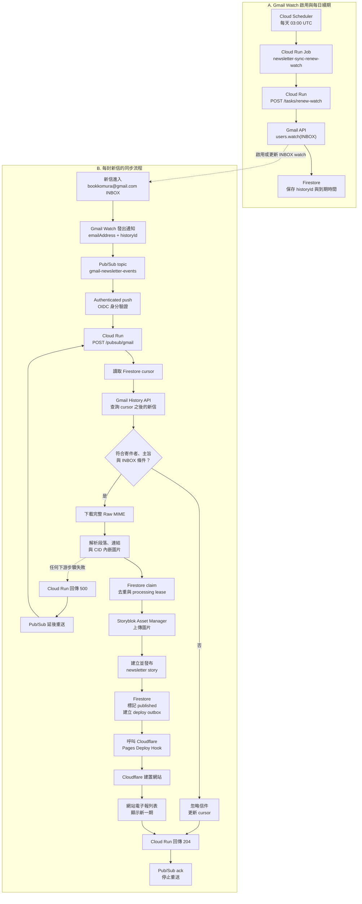
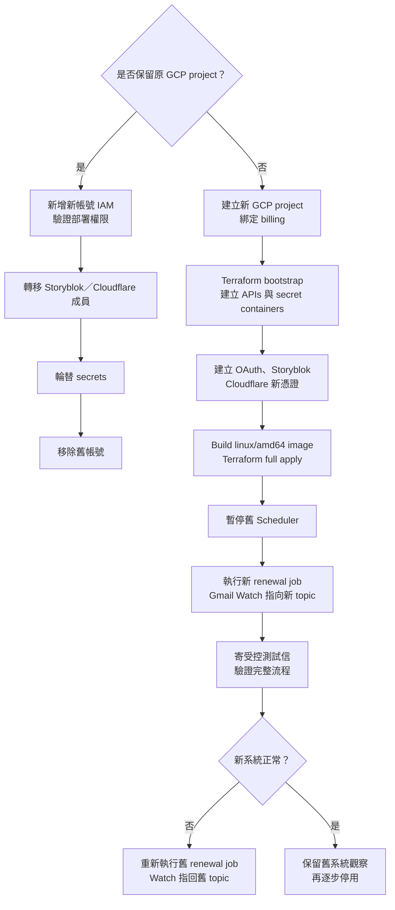

# 電子報 Gmail → CMS 雲端同步與帳號遷移手冊

本文件說明「小村碎碎念」電子報如何從 Gmail 自動同步到 Storyblok，
以及未來更換 Google、Storyblok 或 Cloudflare 帳號時的遷移流程。

敏感值只允許存放在 Google Secret Manager。OAuth Client Secret、
Refresh Token、Storyblok Management Token、Cloudflare Deploy Hook URL
與任務密鑰不得寫進本文件、Git、Terraform variables 或 Terraform state。

## 目前部署清單

| 項目 | 目前值 |
| --- | --- |
| GCP Project ID | `bookstore-space-5sdr` |
| Region | `asia-east1` |
| Cloud Run service | `newsletter-sync` |
| Cloud Run renewal job | `newsletter-sync-renew-watch` |
| Pub/Sub topic | `gmail-newsletter-events` |
| Pub/Sub push subscription | `gmail-newsletter-events-push` |
| Firestore database | `(default)`，Native mode |
| Gmail mailbox | `bookkomura@gmail.com` |
| Storyblok Space ID | `294002703577146` |
| Storyblok folder | 名稱 `Newsletters`、slug `newsletters` |
| Artifact Registry repository | `newsletter-sync` |
| Cloudflare deploy hook | Secret Manager 中的版本，不在 Git 記錄 URL |

符合以下全部條件的信才會被同步：

- 位於 `bookkomura@gmail.com` 的 `INBOX`。
- 寄件者是 `info.rewildesign@gmail.com` 或 `csc981.04@gmail.com`。
- 主旨包含「小村碎碎念」。

## 同步如何被觸發



### 觸發重點

1. Cloud Scheduler 不會讀取信件；它只負責每天執行 renewal job。
2. Renewal job 呼叫 Gmail `users.watch`，建立或更新 INBOX watch。
3. Gmail 發送的 Pub/Sub 通知只包含 mailbox 與 `historyId`，不包含完整信件。
4. Cloud Run 以 Firestore cursor 呼叫 Gmail History API，找出真正新增的信件。
5. Firestore 保存 cursor、watch 到期時間、逐信 claim、發布狀態與 deploy outbox。
6. Storyblok 確認發布後才呼叫 Cloudflare Deploy Hook。
7. 成功回傳 HTTP 204 後 Pub/Sub 才 ack；HTTP 500 會觸發重送。

### 資料與權限邊界

| 系統 | 保存內容 |
| --- | --- |
| Secret Manager | OAuth Client ID/Secret、Refresh Token、Storyblok token、deploy hook、任務密鑰 |
| Firestore | Gmail cursor、watch 到期時間、私有 Message-ID、去重與重試狀態 |
| Storyblok | 公開電子報內容與圖片，不得包含 Gmail Message-ID |
| Cloudflare Pages | build 時取得的公開 Storyblok 內容 |

Cloud Run 不對 `allUsers` 開放。Pub/Sub、renewal job 與 Scheduler 各自使用獨立
service account，並只擁有完成該步驟所需的權限。

## 「搬到其他帳號」可能代表四件不同的事

Google、Gmail、Storyblok 與 Cloudflare 帳號彼此獨立，不一定要同時搬：

| 要搬的部分 | 最低風險做法 |
| --- | --- |
| GCP 管理者帳號 | 保留原 GCP project，新增新管理者 IAM，再移除舊管理者 |
| Gmail mailbox | 重新授權新 mailbox，更新 OAuth 三個 secrets 與 Terraform mailbox 變數 |
| Storyblok 帳號 | 保留原 Space，邀請新帳號並重新產生 Management Token |
| Cloudflare 帳號 | 保留原 Pages project 並轉移成員；或建立新 Pages project 與 deploy hook |
| 全部搬到新帳號 | 在新 GCP project 重新部署，最後進行 Gmail Watch cutover |

如果只是更換負責維護的人，優先使用「保留原 project／space／Pages project，
只轉移 IAM 與帳號權限」。這樣 GCP Project ID、Firestore state、Storyblok story、
資產 URL 與 Cloudflare 網址都不需要改。

## 路徑一：保留原 GCP project，只更換管理者

這是風險最低的帳號交接方式。

1. 在 Google Cloud IAM 將新 Google 帳號加入 `bookstore-space-5sdr`。
2. 先授予與目前部署者相同的 Terraform／部署權限。
3. 新帳號執行：

   ```sh
   gcloud auth login
   gcloud auth application-default login
   gcloud config set project bookstore-space-5sdr
   terraform -chdir=infra/newsletter-sync plan \
     -var project_id=bookstore-space-5sdr \
     -var region=asia-east1 \
     -var image=EXISTING_VERIFIED_IMAGE \
     -var gmail_user_email=bookkomura@gmail.com \
     -var storyblok_space_id=294002703577146
   ```

4. 確認新帳號可以讀取 plan、部署 Cloud Run 與查看 logs。
5. 如需更換 billing account，先在 Billing 完成 project linking，再確認
   `billingEnabled: true`。
6. 在 Storyblok 與 Cloudflare 邀請新帳號，確認可管理 Space／Pages project。
7. 由新負責人重新產生可撤銷的 Storyblok Management Token，新增 Secret Manager
   版本並部署新 Cloud Run revision。
8. 如果 Gmail 授權依賴即將停用的 Google 帳號，使用同一個 OAuth Web Client
   重新授權實際 mailbox，更新 OAuth Refresh Token。
9. 完整驗證後才移除舊管理者帳號。

保留原 project 時，不需要搬 Firestore、不需要重新建立 Gmail Watch，也不需要
更改 Pub/Sub topic。

## 路徑二：整套重建到新的 GCP project

### 遷移決策圖



### 第 0 階段：決定遷移範圍

先記錄以下值，不要記錄任何 secret value：

```text
NEW_PROJECT_ID=
REGION=asia-east1
MAILBOX=
STORYBLOK_SPACE_ID=
CLOUDFLARE_PAGES_PROJECT=
PAGES_URL=
IMAGE_TAG=
```

同時決定：

- 是否沿用原 Storyblok Space。
- 是否沿用原 Cloudflare Pages project 與 domain。
- 是否更換被監看的 Gmail mailbox。
- 是否需要保留 Firestore 的歷史去重狀態。
- 是否需要搬移既有 Storyblok newsletter stories／assets。

### 第 1 階段：準備新帳號與 billing

1. 使用新 Google 帳號建立 GCP project。
2. 將 billing account 綁定新 project。
3. 驗證：

   ```sh
   gcloud billing projects describe NEW_PROJECT_ID
   ```

   必須看到：

   ```yaml
   billingEnabled: true
   ```

4. 新部署者必須能啟用 API、建立 IAM／service accounts、Artifact Registry、
   Cloud Run、Pub/Sub、Firestore、Scheduler 與 Secret Manager 資源。
5. 登入 CLI：

   ```sh
   gcloud auth login
   gcloud auth application-default login
   gcloud config set project NEW_PROJECT_ID
   ```

### 第 2 階段：建立 Artifact Registry

Terraform 模組不建立 Docker repository，因此先手動建立：

```sh
gcloud services enable artifactregistry.googleapis.com \
  --project=NEW_PROJECT_ID

gcloud artifacts repositories create newsletter-sync \
  --repository-format=docker \
  --location=asia-east1 \
  --description="Newsletter sync container images" \
  --project=NEW_PROJECT_ID

gcloud auth configure-docker asia-east1-docker.pkg.dev
```

### 第 3 階段：Terraform bootstrap

```sh
cd infra/newsletter-sync
terraform init
terraform validate

terraform apply \
  -target=google_project_service.required \
  -target=google_secret_manager_secret.runtime \
  -var project_id=NEW_PROJECT_ID \
  -var region=asia-east1 \
  -var image=asia-east1-docker.pkg.dev/NEW_PROJECT_ID/newsletter-sync/newsletter-sync:IMAGE_TAG \
  -var gmail_user_email=MAILBOX_ADDRESS \
  -var storyblok_space_id=STORYBLOK_SPACE_ID
```

這一步只建立必要 APIs 與六個空的 Secret Manager containers。`-target`
只用於 bootstrap，不用於日常部署。

### 第 4 階段：在新 project 建立 Gmail OAuth

1. 在 Google Auth Platform 建立 OAuth consent screen。
2. 使用 External user type；初期維持 Testing。
3. 將實際 mailbox 加入 Test users。
4. 加入 scope：

   ```text
   https://www.googleapis.com/auth/gmail.readonly
   ```

5. 建立 OAuth 2.0 **Web application** client。
6. 加入 OAuth Playground redirect URI：

   ```text
   https://developers.google.com/oauthplayground
   ```

7. 下載該 Web Client 的 JSON 檔。
8. 開啟 OAuth Playground 齒輪：

   - OAuth flow：Server-side
   - Access type：Offline
   - Force prompt：Consent Screen
   - 勾選 Use your own OAuth credentials
   - Client ID／Secret 必須來自同一份 Web Client JSON

9. 選擇 Gmail readonly scope，用實際 `MAILBOX_ADDRESS` 授權。
10. 在 Step 2 按 **Exchange authorization code for tokens**。
11. 保存 Refresh Token；不要保存短效 Access Token。

Desktop Client 不是必要項目。使用 OAuth Playground 時，只需要 redirect URI
正確的 Web Client。

### 第 5 階段：準備 Storyblok

#### 沿用原 Space

1. 邀請新 Storyblok 帳號加入原 Space。
2. 確認新帳號可以管理 Stories、Components 與 Assets。
3. 重新產生 Management Token；不要沿用即將停用帳號的 token。
4. `STORYBLOK_SPACE_ID` 維持不變，既有 stories／assets 不需要搬移。

#### 建立新 Space

1. 依 [Newsletter component contract](storyblok/newsletter-component.md)
   建立以下 components：

   - `newsletter`
   - `newsletter_paragraph`
   - `newsletter_image`
   - `newsletter_link`
   - `newsletter_divider`

2. 在 Content 根目錄建立 Folder：

   - 名稱：`Newsletters`
   - slug：`newsletters`

3. 建立具有 Stories 與 Assets 讀寫權限的 Management Token。
4. 記錄新 Space ID。
5. 如需保留舊內容，先搬移既有 newsletter stories 與 assets，再進行 Gmail
   cutover。不要依靠 Gmail replay 重建所有歷史內容。

### 第 6 階段：準備 Cloudflare Pages

#### 沿用原 Pages project

1. 將新 Cloudflare 帳號加入原帳號／project。
2. 確認 Pages build 仍使用：

   ```text
   Build command: npm run build
   Output directory: dist
   ```

3. 確認 Pages 環境變數 `STORYBLOK_TOKEN` 是 Content Delivery Token，
   不是同步服務使用的 Management Token。
4. 建立新的 Deploy Hook，之後輪替 Secret Manager 版本。

#### 建立新 Pages project

1. 連接相同 Git repository 與 production branch。
2. 設定 build command、output directory 與 `STORYBLOK_TOKEN`。
3. 先完成一次可用的 production deployment。
4. 建立 Deploy Hook。
5. 等新網址驗證完成後才移轉 custom domain／DNS。

### 第 7 階段：新增六個 Secret Manager versions

固定 secret IDs：

```text
newsletter-sync-gmail-oauth-client-id
newsletter-sync-gmail-oauth-client-secret
newsletter-sync-gmail-oauth-refresh-token
newsletter-sync-storyblok-management-token
newsletter-sync-cloudflare-deploy-hook-url
newsletter-sync-replay-shared-secret
```

Client ID 與 Secret 建議直接從同一份 JSON 匯入，避免複製錯誤或換行：

```sh
OAUTH_JSON="/absolute/path/to/client_secret.json"

jq -j '.web.client_id' "$OAUTH_JSON" |
  gcloud secrets versions add newsletter-sync-gmail-oauth-client-id \
    --project=NEW_PROJECT_ID \
    --data-file=-

jq -j '.web.client_secret' "$OAUTH_JSON" |
  gcloud secrets versions add newsletter-sync-gmail-oauth-client-secret \
    --project=NEW_PROJECT_ID \
    --data-file=-
```

Refresh Token、Storyblok Token 與 Cloudflare Deploy Hook URL 建議透過
Google Cloud Console 的 Secret Manager「新增版本」輸入，避免留在 shell history。

產生 replay shared secret：

```sh
openssl rand -hex 32 |
  gcloud secrets versions add newsletter-sync-replay-shared-secret \
    --project=NEW_PROJECT_ID \
    --data-file=-
```

OAuth Client ID、Client Secret 與 Refresh Token 必須屬於同一個 Web Client
與同一次 mailbox 授權。

### 第 8 階段：Build 與完整 Terraform apply

Cloud Run 使用 `linux/amd64`，在 Apple Silicon 上必須明確指定 platform：

```sh
cd /path/to/bookstore-space

IMAGE="asia-east1-docker.pkg.dev/NEW_PROJECT_ID/newsletter-sync/newsletter-sync:IMAGE_TAG"

docker build \
  --platform linux/amd64 \
  --tag "$IMAGE" \
  services/newsletter-sync

docker push "$IMAGE"

cd infra/newsletter-sync

terraform plan \
  -var project_id=NEW_PROJECT_ID \
  -var region=asia-east1 \
  -var image="$IMAGE" \
  -var gmail_user_email=MAILBOX_ADDRESS \
  -var storyblok_space_id=STORYBLOK_SPACE_ID

terraform apply \
  -var project_id=NEW_PROJECT_ID \
  -var region=asia-east1 \
  -var image="$IMAGE" \
  -var gmail_user_email=MAILBOX_ADDRESS \
  -var storyblok_space_id=STORYBLOK_SPACE_ID
```

Apply 後確認輸出包含 service URL、renewal job 與 Gmail Pub/Sub topic。

### 第 9 階段：Gmail Watch cutover

`users.watch` 是「建立或更新」mailbox watch。新 renewal job 成功後，
Gmail 會開始把後續通知送到新 project 的 topic。

建議在低流量時段依以下順序切換：

1. 確認新 Cloud Run、Firestore、Pub/Sub、secrets、Storyblok 與 Cloudflare
   都已準備好。
2. 暫停舊 project 的 Scheduler，避免它在 cutover 後再次把 watch 更新回舊 topic：

   ```sh
   gcloud scheduler jobs pause newsletter-sync-renew-watch \
     --location=OLD_REGION \
     --project=OLD_PROJECT_ID
   ```

3. 等舊 Pub/Sub subscription 的未確認訊息與 Firestore processing lease 清空。
4. 執行新 renewal job：

   ```sh
   gcloud run jobs execute newsletter-sync-renew-watch \
     --region=asia-east1 \
     --project=NEW_PROJECT_ID \
     --wait
   ```

5. 必須看到 execution successfully completed。
6. 不要在 cutover 前呼叫 Gmail `users.stop`；它會關閉該 mailbox 的 push delivery。
7. 新系統驗證完成前保留舊 Cloud Run／Firestore／Pub/Sub，不要立即 destroy。

### 第 10 階段：端到端驗證

寄一封受控測試信：

```text
From: 允許的寄件者
To: MAILBOX_ADDRESS
Subject: 小村碎碎念～遷移測試
Body: 至少一段可讀文字
```

這封信會真的發布 Storyblok story 並觸發 Cloudflare build；測試後視需要取消發布。

檢查最新 Pub/Sub request：

```sh
gcloud logging read \
  'resource.type="cloud_run_revision" AND resource.labels.service_name="newsletter-sync" AND httpRequest.requestUrl:"/pubsub/gmail"' \
  --project=NEW_PROJECT_ID \
  --freshness=30m \
  --limit=20 \
  --order=desc \
  --format='table(timestamp,httpRequest.status,httpRequest.latency,resource.labels.revision_name)'
```

完成條件：

- 最新 Pub/Sub request 回 HTTP 204。
- Firestore `newsletterMessages` 文件狀態為 `published`。
- Firestore `newsletterDeployOutbox` 文件狀態為 `complete`。
- Storyblok `newsletters/` 下存在已發布的 `newsletter` story。
- Cloudflare Pages deploy 已成功完成。
- 公開網站的電子報列表能顯示新一期。

### 第 11 階段：Rollback

如果新系統無法通過端到端驗證：

1. 暫停新 project Scheduler。
2. 使用仍有效的舊 OAuth secrets，重新執行舊 renewal job：

   ```sh
   gcloud run jobs execute newsletter-sync-renew-watch \
     --region=OLD_REGION \
     --project=OLD_PROJECT_ID \
     --wait
   ```

3. 這會再次更新 mailbox watch，使後續通知回到舊 topic。
4. 確認舊系統恢復 HTTP 204 後，再修正新系統。

不要用刪除 Firestore、Pub/Sub topic、secret containers 或 Cloud Run service
作為 rollback 手段。

### 第 12 階段：停用舊環境

新環境穩定觀察後：

1. 確認舊 Pub/Sub 沒有 backlog。
2. 確認舊 Firestore 沒有 `processing` 或待處理 deploy outbox。
3. 保存必要的稽核／除錯紀錄。
4. 停用舊 Scheduler。
5. 撤銷舊 OAuth Refresh Token、Storyblok token 與 Cloudflare Deploy Hook。
6. 移除舊管理者 IAM。
7. 若確定要 destroy 舊 Terraform stack，先另外審查 deletion protection、
   Firestore 與 Secret Manager 的保留策略。

## Firestore 與歷史內容遷移注意事項

新 GCP project 的 Firestore 是空的，因此沒有舊系統的 cursor 與逐信去重資料。

- 如果沿用原 Storyblok Space，既有公開電子報仍會保留。
- 新 watch 會從新的 `historyId` 開始處理後續信件，不會自動重建全部歷史信件。
- 不要在空 Firestore 上任意 replay 舊信；新的 publication key 可能在 Storyblok
  建立重複 story。
- 如果一定要保留跨 project 的 replay／idempotency，需另外規劃 Firestore
  managed export/import，並在 cutover 前停止寫入或處理增量差異。
- 歷史內容搬遷優先使用 Storyblok 的內容／資產遷移流程，而不是重新播放 Gmail。

## 常見問題

### Cloud Run 顯示 `exec format error`

映像是在 Apple Silicon 上建立成 ARM。重新使用：

```sh
docker build --platform linux/amd64 ...
```

並以新 immutable tag 部署。

### Gmail renewal job 顯示 `invalid_client`

通常是 Client ID、Client Secret 與 Refresh Token 不屬於同一個 OAuth Web Client。

不顯示值地比對 JSON 與 Secret Manager bytes：

```sh
jq -j '.web.client_id' "$OAUTH_JSON" | shasum -a 256
gcloud secrets versions access latest \
  --secret=newsletter-sync-gmail-oauth-client-id \
  --project=PROJECT_ID |
  shasum -a 256

jq -j '.web.client_secret' "$OAUTH_JSON" | shasum -a 256
gcloud secrets versions access latest \
  --secret=newsletter-sync-gmail-oauth-client-secret \
  --project=PROJECT_ID |
  shasum -a 256
```

兩組 hash 必須各自相同。重新產生 Refresh Token 時也必須使用同一份 JSON。

### Firestore 顯示 `Storyblok folder newsletters was not found`

在 Storyblok Content 根目錄建立名稱 `Newsletters`、slug `newsletters` 的 Folder。

### Secret Manager 已更新但 Cloud Run 還是讀到舊值

部署新的 Cloud Run revision。Secret 使用 `latest`，但既有 revision 不應被視為
已自動重新載入環境變數。

### Terraform provider 顯示 inconsistent final plan

如果第一次 apply 已建立 Cloud Run 並取得 service URL，但依賴該 URL 的 Job 或
Pub/Sub subscription 因 provider bug 中斷，先檢查 plan；確認沒有 destroy 後，
再次執行完整 `terraform apply`。

## 官方參考

- [Gmail API push notifications](https://developers.google.com/workspace/gmail/api/guides/push)
- [Gmail API OAuth scopes](https://developers.google.com/workspace/gmail/api/auth/scopes)
- [Firestore managed export/import](https://cloud.google.com/firestore/native/docs/manage-data/export-import)
- [Cloudflare Pages Deploy Hooks](https://developers.cloudflare.com/pages/configuration/deploy-hooks/)
- [Storyblok upload and replace assets](https://www.storyblok.com/docs/api/management/assets/upload-and-replace-assets)

